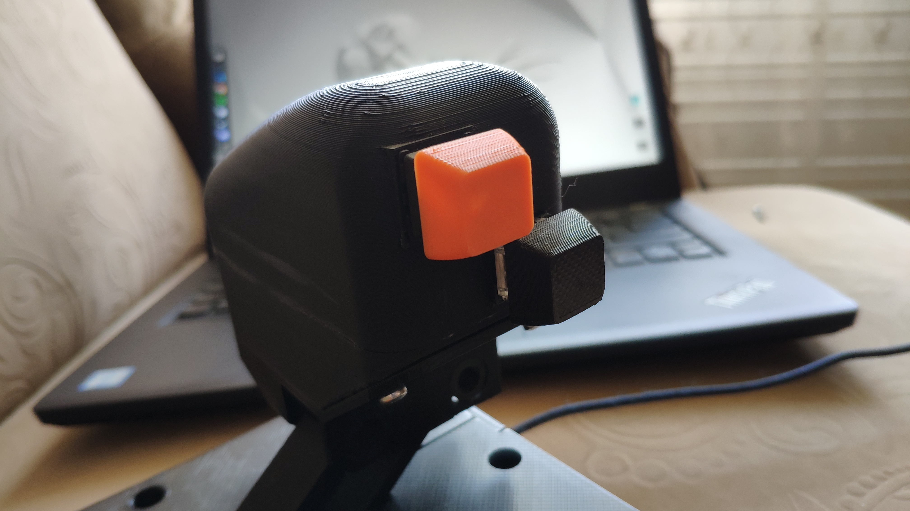

# throttle
## arduino micro based flight sim controller

Keypad pattern is optimized for Elite Dangerous gameplay and represent following binds:

````
1 2 3 4
 q w e
 a s d 
 z x space
````
Thumb buttons on the handle are assigned for hyperdrive and boost.

Switch idea is to cut off throttle lever while fuel scooping or auto docking, but there is no such option in game. In fact it overwrite throttle with 0% all the time. It's working, but it's not very elegnat solution.
### part list
 - 3d printed parts designed by me in OnShape (stls folder).
 - 15 mechanical switches
 - 1 arduino micro (https://github.com/MHeironimus/ArduinoJoystickLibrary)
 - 1 potentiometer
 - 1 bistable switch
### ubuntu jstest-gtk calibration video
[](http://www.youtube.com/watch?v=AvlxDVjkK_g "Video Title")
### images

#### case




#### electronics


